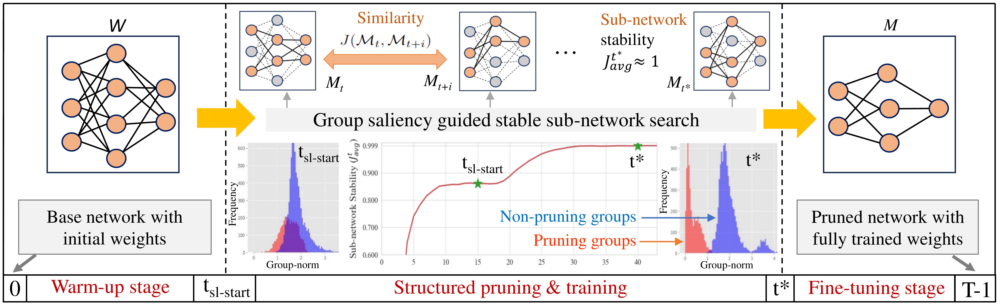

# One-Cycle Structured Pruning via Stability-Driven Subnetwork Search, [WACV 2026](https://wacv.thecvf.com/) (Accepted)

This repository contains the official implementation of the paper:  
**[One-Cycle Structured Pruning via Stability-Driven Subnetwork Search (WACV 2026)](https://arxiv.org/abs/2501.13439)**  

---

## 📄 Abstract  
Structured pruning methods often rely on multi-stage training procedures that incur heavy computational costs. Pruning at initialization reduces training overhead but typically sacrifices performance. To address these challenges, we propose an efficient **one-cycle structured pruning framework** that preserves model accuracy. Our approach integrates pre-training, pruning, and fine-tuning into a single training cycle, referred to as the *one-cycle approach*.  

The key idea is to identify the optimal sub-network early in training, guided by **norm-based group saliency criteria** and **structured sparsity regularization**. We further introduce a novel **pruning indicator** that determines the stable pruning epoch by measuring the similarity between evolving sub-networks across consecutive epochs. The group sparsity regularization accelerates pruning, further reducing training time.  

Extensive experiments on **CIFAR-10/100** and **ImageNet** with **VGGNet, ResNet, and MobileNet** demonstrate that our method achieves **state-of-the-art accuracy** while being among the most efficient pruning frameworks in terms of training cost.  

🔗 [Paper link (WACV 2026)](https://arxiv.org/abs/2501.13439)  
📂 [Code](https://github.com/ghimiredhikura/OCSPruner)  

## 📊 Algorithm Pipeline



**Figure:** Overview of the OCSPruner algorithm. The process begins by training the baseline model from scratch. Starting at epoch $t_{\text{sl-start}}$, the pruning sub-structure gradually stabilizes, as indicated by the sub-network stability score computed over consecutive training epochs. Final pruning occurs at the stable epoch $t^*$, followed by the remaining training epochs to converge the pruned structure.

---

## ⚙️ Experimental Environment  
- **OS:** Ubuntu 20.04.6 LTS  
- **GPU:** 2 × NVIDIA GeForce RTX 4090  
- **CUDA:** 12.0  
- **Python:** 3.11.3  
- **PyTorch:** 2.0.1  
- **torchvision:** 0.15.2  
- **numpy:** 1.24.3  

---

## 🚀 Usage  

### 🔹 Preparing ImageNet Dataset

1. Download the **ImageNet ILSVRC 2012** dataset from the official [ImageNet website](https://www.image-net.org/).  
2. Extract the dataset into a folder, e.g., `D:/ImageNet/`.
3. Update the dataset path in `main_imagenet.py`:

```python
parser.add_argument(
    "--data-path", 
    default="D:/ImageNet/",  # set your ImageNet folder here
    type=str, 
    help="dataset path"
)
```

### 🔹 Pruning on CIFAR-10/100  
Run the script `scripts/prune_cifar.sh` to prune VGGNet and ResNet models on CIFAR-10/100 datasets.
```ruby
sh scripts/prune_cifar.sh
```

### 🔹 Evaluation on CIFAR-10/100
Evaluate pruned models stored in `ocspruner_pruned_models/CIFAR-10-100` using script `scripts/eval_cifar.sh`

```ruby
sh scripts/eval_cifar.sh
```

### 🔹 Pruning on ImageNet

Run the script `scripts/prune_imagenet.sh` to prune on ImageNet dataset.

```ruby
sh scripts/prune_imagenet.sh
```

### 🔹 Evaluation on ImageNet

Evaluate ResNet18 and ResNet50 pruned models stored in `ocspruner_pruned_models/ImageNet` using script `scripts/eval_imagenet.sh`

```ruby
sh scripts/eval_imagenet.sh
```

> ✅ Note: Only a few sample pruned models are included with this release. Additional pruning results will be made available upon request.

## 📜 Citation

If you find this work useful, please cite our paper:

```bibtex
@inproceedings{ghimire2026ocspruner,
  title={One-Cycle Structured Pruning via Stability-Driven Subnetwork Search},
  author={Ghimire, Deepak and Kil, Dayoung and Jeong, Seonghwan and Park, Jaesik and Kim, Seong-heum},
  booktitle={Proceedings of the IEEE/CVF Winter Conference on Applications of Computer Vision (WACV)},
  year={2026}
}
